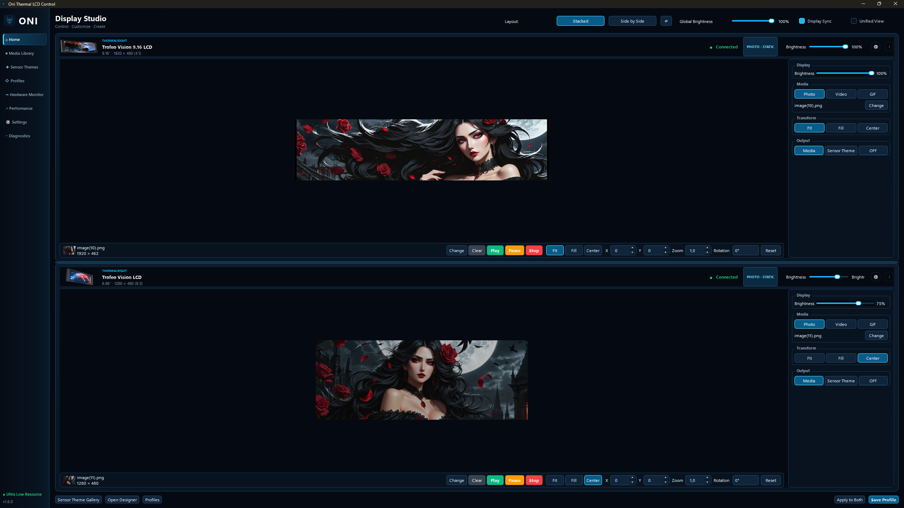
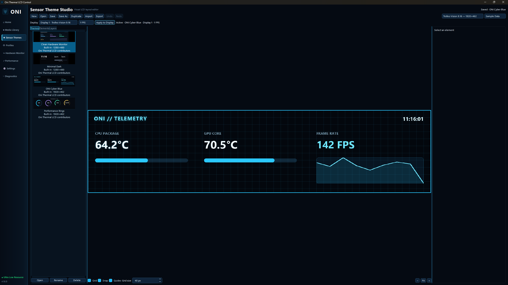
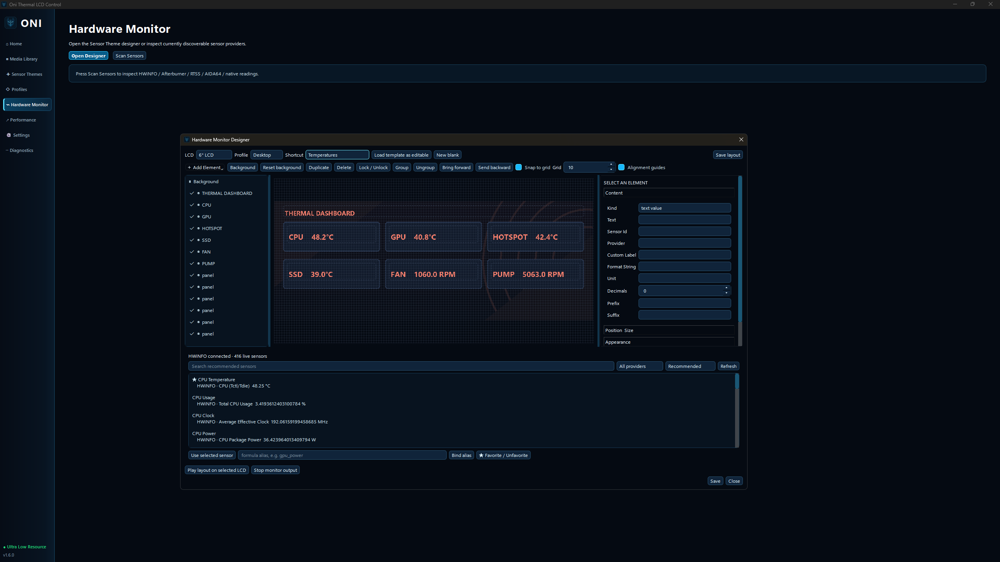

# Oni Thermal LCD Control

> **Development Preview / Work in Progress**
>
> This project is still under active development. The current source is public so people can follow progress and test the application, but some workflows are incomplete and known UI/runtime bugs remain. **Do not treat the current repository as a finished stable release yet.**

Oni Thermal LCD Control is a Windows desktop application for configuring and driving supported Thermalright USB LCD displays. It provides dual-display control, photo/video/GIF playback, sensor themes, profiles, hardware monitoring, performance controls, and diagnostics in an ONI-themed interface.

> **Safety:** USB output is fail-closed. A display must match a locally reviewed authorization entry before the application can send generated media. The public source distribution does not include machine-specific authorization records.

## Screenshots

### Home / dual-display workspace



### Sensor Theme Editor



### Hardware Monitor



## Current development status

The application is usable from source, but the Sensor Theme / Hardware Monitor workflow is still being completed.

Known work in progress:

- Sensor Theme deployment is still being integrated end-to-end with the existing LCD output runtime.
- **Sensor + Media** combined output needs to be restored/verified.
- A floating/child preview window can still appear in some Sensor Theme states and must be removed.
- Editing/moving Sensor Theme elements can currently break or detach the active LCD deployment in some cases.
- Hardware Monitor customization does not yet expose every supported editable property.
- Saved Hardware Monitor layouts still need a complete **Save -> Home selector -> Play/Apply -> LCD** workflow.
- Saved user themes/layouts need reliable Home refresh, rename/delete handling, restart restore, and dual-display deployment verification.
- Final installer / downloadable stable release will come after these remaining regressions are fixed and validated.

If you test the current preview, expect active development and changes.

## Supported displays

Current support targets these Thermalright USB product IDs:

| USB ID | Display |
| --- | --- |
| `0416:5408` | Trofeo Vision 9.16 LCD, 1920 × 480 |
| `0416:5302` | Trofeo Vision LCD / 6.86 LCD, 1280 × 480 |

Hardware revisions can differ. Confirm the detected device in Diagnostics and keep output disabled until the exact unit has been reviewed.

## Features

- Independent or synchronized control of two supported LCDs
- Photo, video, and animated GIF playback with fit, fill, position, zoom, and rotation controls
- Data-driven, customizable Sensor Theme engine
- Visual Sensor Theme editor under active development
- Editable hardware-monitor layouts
- Reusable profiles and per-display settings
- Startup restore, tray operation, brightness, performance, and diagnostics controls
- Strict per-device authorization gates for USB writes
- Portable Windows build pipeline with no separate Python installation required for packaged builds

## Install on Windows

### Current preview

There is no recommended stable public installer release yet.

For now, clone/download the source and run the application from the repository. A public installer and portable release will be published after the remaining Sensor Theme and Hardware Monitor integration work is completed.

### Future installer

The project already contains the local installer/build pipeline. Once the stable release is ready, the installer will be published as:

`Oni-Thermal-LCD-Control-Setup.exe`

## Development setup

The validated development runtime is **Python 3.12 on Windows**.

```powershell
py -3.12 -m venv .venv
.\.venv\Scripts\Activate.ps1
python -m pip install --upgrade pip
python -m pip install -e ".[gui]"
```

Alternatively, install the minimum runtime list with:

```powershell
py -3.12 -m pip install -r requirements.txt
```

The local `config/device-allowlist.json` is intentionally not versioned because it contains machine-specific hardware identifiers. Start from `config/device-allowlist.example.json`; do not enable write authorization unless the device and transport have been independently validated.

## Run from source

The easiest Windows development-preview launch is:

```text
run-gui.bat
```

Or run directly:

```powershell
$env:PYTHONPATH = "src"
py -3.12 -m thermalright_lcd.gui
```

The safe smoke mode is:

```text
run-gui.bat --smoke-test
```

## Sensor Themes

The Sensor Theme system is data-driven rather than a collection of hard-coded layouts.

Current theme support includes:

- custom positions and sizes
- text and sensor values
- images and icons
- progress/horizontal/vertical bars
- ring and arc gauges
- line graphs
- clock/date
- colors, fonts, borders, glow and opacity
- logical sensor bindings
- import/export using `.oni-theme`
- separate built-in and user-created themes

See [docs/sensor-themes.md](docs/sensor-themes.md) for the current format and safety model.

## Tests

Run the complete validation from the repository root:

```powershell
$env:PYTHONPATH = "src"
py -3.12 -m unittest discover -s tests -q
py -3.12 -m pytest -q
py -3.12 tools\ui_lock.py check
```

Never update the UI-lock baseline simply to silence an unexpected visual change.

## Build release artifacts

Install the development dependencies, PyInstaller, and Inno Setup 6, then run:

```powershell
powershell -NoProfile -ExecutionPolicy Bypass -File .\packaging\build-portable.ps1
powershell -NoProfile -ExecutionPolicy Bypass -File .\packaging\build-installer.ps1
```

The portable application is written to `dist\`. The installer is written to `dist-installer\Oni-Thermal-LCD-Control-Setup.exe`. See `docs/packaging.md` for packaging details.

## Troubleshooting

- **Display is not listed:** reconnect it directly to the PC, avoid unpowered hubs, and check the Diagnostics page.
- **Output remains disabled:** this is expected until the exact device has a reviewed local authorization entry. Do not bypass the safety gate.
- **Media will not play:** install the `gui` dependency group for source runs and confirm the file is readable by FFmpeg/PyAV.
- **A second launch exits:** the first instance is restored because the application uses single-instance behavior.
- **Settings need inspection:** logs and settings are stored below `%LOCALAPPDATA%\OniThermalLcd`.

## Contributing

Read [CONTRIBUTING.md](CONTRIBUTING.md) before opening a change. Device transport changes require reproducible evidence and must preserve all authorization and safety gates.

Bug reports are welcome while the project is in preview. Please include the display model, exact workflow, and reproducible steps when possible.

## License

Oni Thermal LCD Control is released under the [MIT License](LICENSE). Third-party components retain their own licenses; packaged builds include `THIRD_PARTY_NOTICES.md` and the corresponding license texts.
